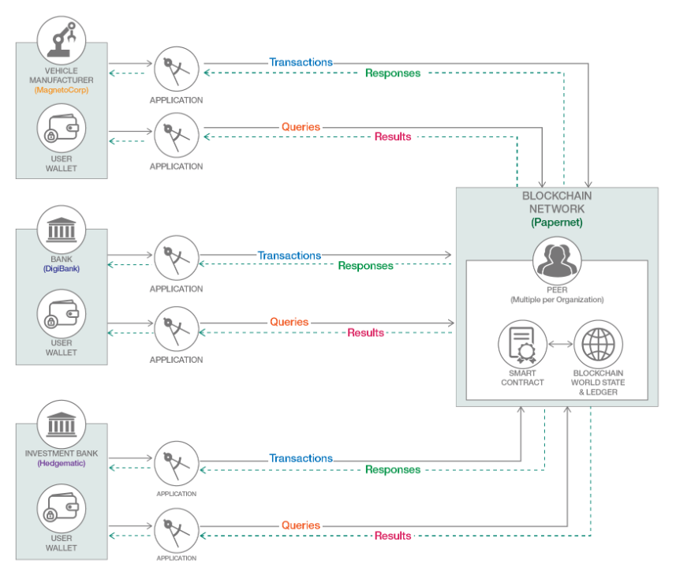

<a name="top"></a>

# Introduction: Commercial Paper Tutorial & Samples

This folder contains a comprehensive set of smart contracts and application clients (ie. in a choice of languages, eg Node.JS, Java, Go etc) that executes a Commercial Paper, a global finance & investment use case. The sample contract also provide a range of queries to try out, to consolidate what you learn when you execute transactions during the tutorial.

While a more detailed 'explainer' of the Commercial Paper scenario (including use case analysis, code walkthrough & practices, logical/physical representation of ledger data etc) can be found in the [Hyperledger Fabric Commercial Paper Tutorial](https://hyperledger-fabric.readthedocs.io/en/latest/tutorial/commercial_paper.html), you don't have to read through this, just to try out this sample. 

<details><summary>Key Objectives of Sample </summary>
* see a Commercial Paper use case in action
* explore the key 'takeaways': understand differences between asset _state_ changes ('e.g. 'lifecycle') and transaction _inputs_* (e.g. 'inputs' during lifecycle)
* try out a number of different query types: asset history, asset state, ownership, partial key, named query (criteria-based), ad-hoc queries (you supply a query)

\* the smart contract uses these (along with business logic) to decide outcomes; some inputs change the asset _state_ (like 'ownership') ; some don't.

</p>
</details>

But first, it might useful to explain Commercial Paper, a form of financial bond issued to obtain capital, and operates in global financial markets. A Commercial Paper instance is represented as an asset with a lifecycle, recorded on the blockchain - transactions change its _state_ (over time) and those transactions, naturally - have _inputs_.

Expand the twisty below to see an overview of a 'typical' Commercial paper marketplace - transactions, queries being executed by different organisations (we'll focus on two of these organisations)

<details><summary>PaperNet Overview - commercial paper marketplace</summary>



</p>
</details>


#### Explainers 

<details><summary>Commercial Paper - what is it briefly?</summary>
 
</br>
It is a financial instrument, issued by established companies (eg big manufacturers, blue chip corporations) to gain short-term capital - usually no more than 6-9 months. Why? To meet short-term financial obligations. They issue a paper  ('bond', promissory note) for specific projects, such as big capital investments, to pay contractors or even debt restructuring. The tutorial describes MagnetoCorp (car manufacturer) who landed a huge contract, and will need $5m in capital (payroll obligations), to hire 1000 car workers for at least 6 months (with no car revenues yet - its a financial strain).

</p>
</details>

<details><summary>Ins and Outs, Attractions of Commercial Paper Investment?</summary>

</br>
Investors (who buy Commercial Paper) are attracted as they agree to buy them at a discount (say $4.94m) on the face value (eg $5m) and obtain a higher yield than if they were simply gaining interest in a bank (eg. 2% interest on $4.95m today = $5m in 6 months time). The difference represents a 'premium' for carrying the risk of a debt/loan that is unsecured (unlike a bank) - which is where credit risk and ratings comes in. The actual yield from the investment chosen is in effect $10k greater (than pure interest). 
</p>
Once an issuing corporation becomes established in the commercial paper marketplace, it builds a high credit rating (risk affects how much of a premium investors seek and therefore discount accordingly) - in fact, it is often cheaper (for a blue chip company) to draw on a commercial paper than on a bank line of credit.
</p>
I mentioned marketplace: even during a 6-9 month period, a commercial paper can be bought and sold multiple times, before the Commercial Paper reaches its maturity date, the day when the current investor (or owner) 'redeems' the paper bond with MagnetoCorp the issuer and gets its $5m (the face value) back.

</details>

## Scenario Overview


In this tutorial two organizations, MagnetoCorp and DigiBank, trade commercial paper with each other on 'PaperNet', the marketplace represented by a Hyperledger Fabric blockchain network. 

The tutorial shows the commercial paper asset lifecycle: _issue_, _buy_ ( 1 to _n_ ), and _redeem_ transactions: the key 'takeaways' from the scenario are:

- understanding the  _changes in state_ in the commercial paper asset (reflected in the ledger world state) which reaches maturity after 6 months.
- understanding the _transaction inputs_  for each transaction (some inputs change the asset  _state_ - eg. ownership) and some _don't_  (e.g. purchase price) and not part of the asset - but importantly, the _inputs_ for a given transaction are recorded on the blockchain).
- understanding the importance of _queries_  such as: asset history, rich queries (criteria matching etc), transaction history (where the inputs are recorded)

Client applications (CLI based) are used, to perform the transactions. 

It uses the `test-network` (which is part of Fabric Samples). You’ll act as Isabella, an employee of MagnetoCorp (Org1), who will issue a commercial paper on its behalf. You’ll then switch hats to take the role of Balaji, an employee of DigiBank (Org2), who will buy this commercial paper, hold it for a period of time, and then redeem it with MagnetoCorp for a small profit or yield. Then later, you'll query the ledger - that's it :-) 


## Quick Start

Below are the quick start instructions for running the tutorial. As mentioned, if you're interested in a 'deeper dive' analysis and importance of the concepts, design, structure and implementation  of the smart contract,  they can be found in the [Hyperledger Fabric Commercial Paper Tutorial](https://hyperledger-fabric.readthedocs.io/en/latest/tutorial/commercial_paper.html). Suffice to say, you DON'T have to have read this, to do this tutorial.

This `README.md` file is in the `commercial-paper` directory, the source code for client applications and the contracts is in the `organization` directory.

### Steps

1) Start the Hyperledger Fabric infrastructure

   The 'test-network' will be used - this has two organizations 'org1' and 'org2'  DigiBank will be org1, and MagnetoCorp will be org2. 

2) Install and Instantiate the Contracts

3) Run client applications in the roles of MagnetoCorp and DigiBank to trade the commercial paper

   - Issue the Paper as Magnetocorp (org2)
   - Buy the paper as DigiBank (org1)
   - Redeem the paper as DigiBank (org1)

## Setup

You will need a machine with the following

- Docker and docker-compose installed
- Node.js v12 if you want to run JavaScript client applications
- Java v8 if you want to run Java client applications
- Maven to build the Java applications

You will need to install the peer cli binaries and this fabric-samples repository available. For more information
[Install the Samples, Binaries and Docker Images](https://hyperledger-fabric.readthedocs.io/en/latest/install.html) in the Hyperledger Fabric documentation.

It is advised to have 3 console windows open; 

* one to monitor the infrastructure and 
* one each for MagnetoCorp and 
* DigiBank. 

Once you've cloned the fabric-samples - change to the commercial-paper directory in each window. 

```
cd fabric-samples/commercial-paper
```

## Running the Infrastructure

In one console window, run the `./network-starter.sh` script; this will start the basic infrastructure.

You can re-use this console window if you wish, but it is recommended to run a docker container monitoring script. This will let you view what Fabric is doing and help diagnose any failures.

```bash
./organization/magnetocorp/configuration/cli/monitordocker.sh net_test
```

### Setup the Organizations' environments

The contract code is available as either JavaScript, Java or Go. You can use either one, and the choice of contract language does not affect the choice of client language. With the v2.0 Fabric chaincode lifecycle, this requires operations for both MagnetoCorp and Digibank admin.  Open two windows in the fabric-samples/commercial paper directory, one for each organization.

In your 'MagnetoCorp' window run the following commands, to show the shell environment variables needed to act as that organization.

```
cd fabric-samples/commercial-paper/organization/magnetocorp
./magnetocorp.sh
```

You can either copy and paste them directly into the terminal, or invoke directly in your own command shell. For example if you are using bash or zsh on Linux you can use this command.

```
source <(./magnetocorp.sh)
```

Similarly in your 'DigiBank' window run the following command

```
cd fabric-samples/commercial-paper/organization/digibank
./digibank.sh
```

### Deploy the smart contract to the channel

You need to perform similar operations for both organizations. For different contract languages the steps are very similar. The steps for JavaScript are shown first, with the details of different languages afterwards. 


**For a JavaScript Contract**

Running in MagnetoCorp:

```
# MAGNETOCORP

peer lifecycle chaincode package cp.tar.gz --lang node --path ./contract --label cp_0
peer lifecycle chaincode install cp.tar.gz

export PACKAGE_ID=$(peer lifecycle chaincode queryinstalled --output json | jq -r '.installed_chaincodes[0].package_id')
echo $PACKAGE_ID

peer lifecycle chaincode approveformyorg  --orderer localhost:7050 --ordererTLSHostnameOverride orderer.example.com \
                                          --channelID mychannel  \
                                          --name papercontract  \
                                          -v 0  \
                                          --package-id $PACKAGE_ID \
                                          --sequence 1  \
                                          --tls  \
                                          --cafile $ORDERER_CA
                                          
peer lifecycle chaincode checkcommitreadiness --channelID mychannel --name papercontract -v 0 --sequence 1
```

Running in Digibank

```

# DIGIBANK

peer lifecycle chaincode package cp.tar.gz --lang node --path ./contract --label cp_0
peer lifecycle chaincode install cp.tar.gz

export PACKAGE_ID=$(peer lifecycle chaincode queryinstalled --output json | jq -r '.installed_chaincodes[0].package_id')
echo $PACKAGE_ID

peer lifecycle chaincode approveformyorg  --orderer localhost:7050 --ordererTLSHostnameOverride orderer.example.com \
                                          --channelID mychannel  \
                                          --name papercontract  \
                                          -v 0  \
                                          --package-id $PACKAGE_ID \
                                          --sequence 1  \
                                          --tls  \
                                          --cafile $ORDERER_CA

peer lifecycle chaincode checkcommitreadiness --channelID mychannel --name papercontract -v 0 --sequence 1

```

Once both organizations have installed, and approved the chaincode, it can be committed.

```
# MAGNETOCORP

peer lifecycle chaincode commit -o localhost:7050 \
                                --peerAddresses localhost:7051 --tlsRootCertFiles ${PEER0_ORG1_CA} \
                                --peerAddresses localhost:9051 --tlsRootCertFiles ${PEER0_ORG2_CA} \
                                --ordererTLSHostnameOverride orderer.example.com \
                                --channelID mychannel --name papercontract -v 0 \
                                --sequence 1 \
                                --tls --cafile $ORDERER_CA --waitForEvent 

```

To test try sending some simple transactions.

```

peer chaincode invoke -o localhost:7050  --ordererTLSHostnameOverride orderer.example.com \
                                --peerAddresses localhost:7051 --tlsRootCertFiles ${PEER0_ORG1_CA} \
                                --peerAddresses localhost:9051 --tlsRootCertFiles ${PEER0_ORG2_CA} \
                                --channelID mychannel --name papercontract \
                                -c '{"Args":["org.papernet.commercialpaper:instantiate"]}' ${PEER_ADDRESS_ORG1} ${PEER_ADDRESS_ORG2} \
                                --tls --cafile $ORDERER_CA --waitForEvent

peer chaincode query -o localhost:7050  --ordererTLSHostnameOverride orderer.example.com \
                                        --channelID mychannel \
                                        --name papercontract \
                                        -c '{"Args":["org.hyperledger.fabric:GetMetadata"]}' \
                                        --peerAddresses localhost:9051 --tlsRootCertFiles ${PEER0_ORG2_CA} \
                                        --tls --cafile $ORDERER_CA | jq -C | more
```

**For a Java Contract:**

Before the `peer lifecycle chaincode package` command, you will need to change into each organization's `contract-java` directory and issue

```
./gradlew build
```

Then from the parent directory when you package the contract, use this variation of the command to specify the java specific contract
```
peer lifecycle chaincode package cp.tar.gz --lang java --path ./contract-java --label cp_0
```

After this point the steps are exactly the same as for JavaScript

**For a Go Contract:**


Before the `peer lifecycle chaincode package` command, you will need to change into each organization's `contract-go` directory and issue

```
go mod vendor
```

Then from the parent directory when you package the contract, use this variation of the command to specify the go specific contract
```
peer lifecycle chaincode package cp.tar.gz --lang golang --path ./contract-go --label cp_0
```

After this point the steps are exactly the same as for JavaScript


## Client Applications

Note for Java applications you will need to compile the Java Code using maven. Use this command in each application-java directory

```
mvn clean package
```

Note for JavaScript applications you will need to install the dependencies first. Use this command in each application directory

```
npm install
```
>  Note that there is NO dependency between the language of any one client application and any contract. Mix and match as you wish!

The docker containers don't contain the node or Java runtimes; so it is best to exit the docker containers - but keep the windows open and run the applications locally.

### Issue the paper

This is running as *MagnetoCorp* These commands are to be run in the
`commercial-paper/organization/magnetocorp/application` directory or the `commercial-paper/organization/magnetocorp/application-java`

*Add the Identity to be used*

```
node addToWallet.js
# or
java -cp target/commercial-paper-0.0.1-SNAPSHOT.jar org.magnetocorp.AddToWallet
```

*Issue the Commercial Paper*

```
node issue.js
# or
java -cp target/commercial-paper-0.0.1-SNAPSHOT.jar org.magnetocorp.Issue
```

### Buy and Redeem the paper

This is running as *Digibank*; 

You can now run the applications to buy and redeem the paper. Change to either the
`commercial-paper/organization/digibank/application` directory or  `commercial-paper/organization/digibank/application-java`

*Add the Identity to be used*

```
node addToWallet.js
# or
java -cp target/commercial-paper-0.0.1-SNAPSHOT.jar org.digibank.AddToWallet
```

*Buy the paper*

```
node buy.js
# or
java -cp target/commercial-paper-0.0.1-SNAPSHOT.jar org.digibank.Buy
```

*Redeem*

```
node redeem.js
# or
java -cp target/commercial-paper-0.0.1-SNAPSHOT.jar org.digibank.Redeem
```

## Clean up
When you are finished using the Fabric test network and the commercial paper smart contract and applications, you can use the following command to clean up the network:

```
./network-clean.sh 
```

<sup>[_back to top_](#top)</sup>
